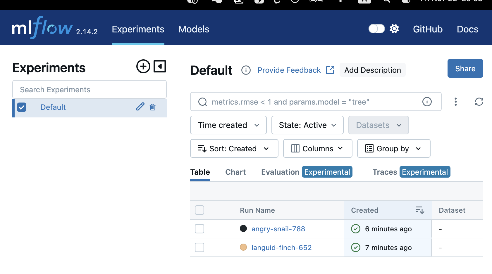

[](https://github.com/nogibjj/DEmini12/actions/workflows/cicd.yml)

## DEmini 12 - Machine Learning kit in Docker

## Purpose of project
 This pipeline will involve tasks such as extracting data from Kaggle public datasets, cleaning and transforming the data, then loading it into Sqlite. Once the data is in place, we'll be able to run complex queries that may involve tasks like joining tables, aggregating data, and sorting results. 

## Preparation
1. open codespaces 
2. wait for container to be built and virtual environment to be activated with requirements.txt installed 
3. Model Training: -Split the data into training and testing sets. -Train the model on the training set.



### Preparation: 
1. git clone the repo
2. install: `make install`
3. run: `python main.py`
4. run: `mlflow ui` to view mlflow interface 
5. view saved model and other artifacts in `mlruns/0`

### Check Format and Test Errors: 
1. Format code `make format`
2. Lint code `make lint`
3. Test coce `make test`


### File Structure
```
DEmini6/
├── .devcontainer/
│   ├── devcontainer.json
│   └── Dockerfile
├── .github/
├── .gitignore
├── data/
│   ├── instagram_Data.csv
├── Dockerfile
├── LICENSE
├── main.py
├── Makefile
├── mylib/
│   ├── __init__.py
│   ├── __pycache__/
├── README.md
├── requirements.txt
├── setup.sh
└── test_main.py
```

